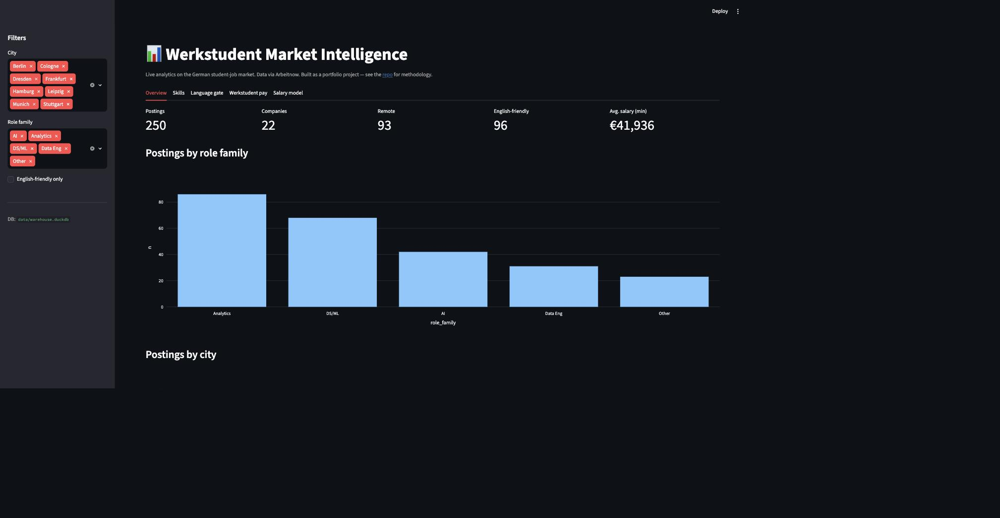
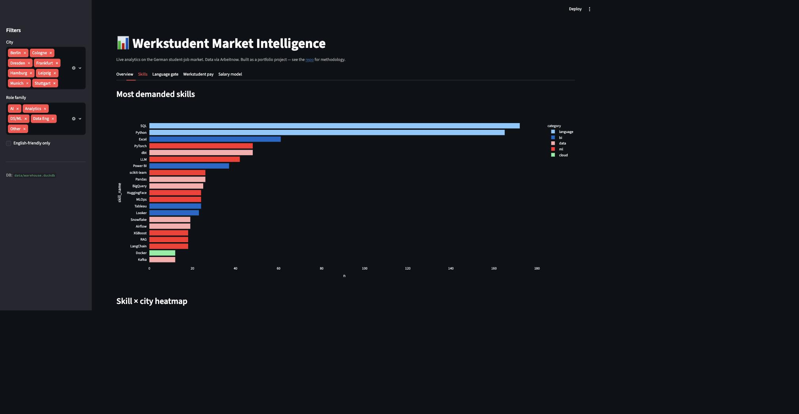
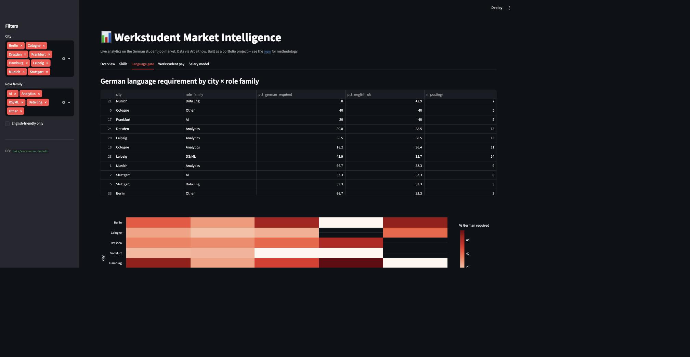
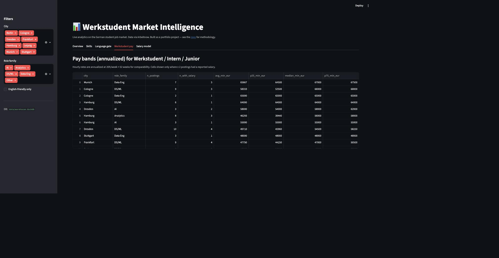
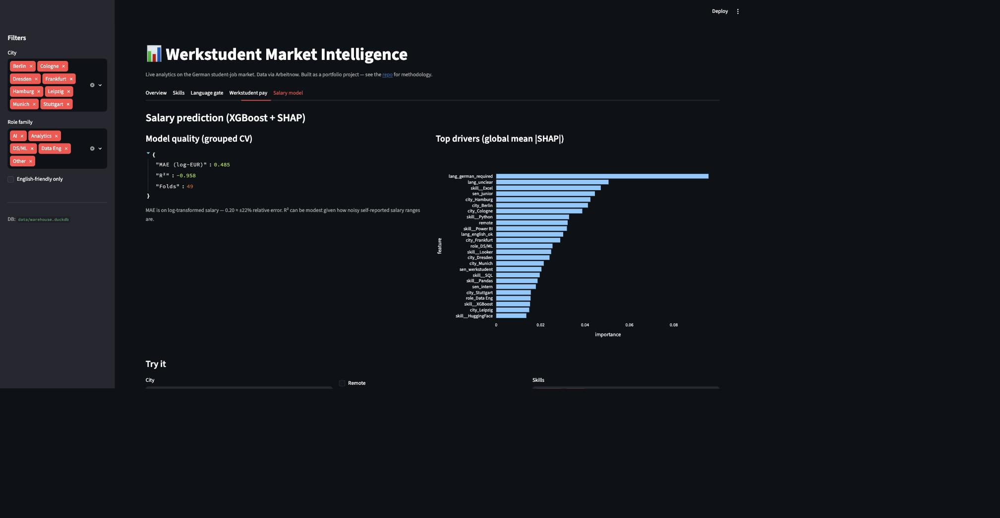

# Werkstudent Market Intelligence

**A modern data stack pipeline that analyses the German student-job market to answer questions job boards can't.**

*Live demo:* [Streamlit Cloud link — add after deployment]
*Data through:* run `make ingest` to refresh from the Arbeitnow API

---

## What this answers

Job boards let you search. They don't let you ask questions like:

- Which skills correlate with **English-friendly** postings? (For international students hitting the B1/B2 German wall.)
- What's the going hourly rate for a Werkstudent Data role in Munich vs. Leipzig vs. remote?
- Which stacks are gaining vs. losing share month-over-month?
- Given a job description, what salary should it pay? Which features drive the prediction?

The pipeline pulls live postings, models them into a proper warehouse, and surfaces answers via a Streamlit dashboard plus an XGBoost salary predictor with SHAP explanations.

## Why it exists

I'm an MSc Data Science student in Leipzig job-hunting for Werkstudent roles. The tools available for this search are bad — filtering on "English-speaking" or "no German required" is either missing or wrong on every major board. So I built the thing I wanted to use, and along the way made it a portfolio piece that demonstrates the analytics stack end-to-end.

## Screenshots

**Overview** — postings, companies, remote/English-friendly share, and role-family breakdown at a glance.


**Skills** — most-demanded skills across postings, colored by category (language, BI, data, ML, cloud).


**Language gate** — % of postings requiring German, broken down by city × role family.


**Werkstudent pay** — annualized pay bands (avg/percentiles) by city and role family.


**Salary model** — XGBoost model quality metrics plus global SHAP feature importance.


## Architecture

```
┌──────────────┐    ┌──────────┐    ┌────────────────┐    ┌───────────┐
│ Arbeitnow    │───▶│ DuckDB   │───▶│ SQL models     │───▶│ Streamlit │
│ REST API     │    │ (raw)    │    │ staging → mart │    │ dashboard │
└──────────────┘    └──────────┘    └────────────────┘    └───────────┘
                                            │
                                            ▼
                                    ┌────────────────┐
                                    │ XGBoost model  │
                                    │ + SHAP         │
                                    └────────────────┘
```

**Design choices worth noting:**

- **DuckDB over Postgres** — zero-setup, columnar, fast enough for millions of rows. Same SQL either way, so migration is trivial if the project grows.
- **dbt-style SQL layering** (staging → marts) without dbt itself, to keep the dep list short. The SQL is written so `dbt` could be dropped in later without rewrites.
- **Regex-based skill extraction** over LLM-based — deterministic, fast, testable, no API costs. The skill taxonomy lives in `src/transform/skills.py` and is easy to extend.
- **Model target is `salary_min_eur`**, not a classification bucket, because SHAP on a regressor gives more interpretable feature attributions.

## Repo layout

```
werkstudent-market-intel/
├── src/
│   ├── ingest/arbeitnow.py       # API client + pagination + dedup
│   ├── transform/skills.py        # skill extractor + taxonomy
│   ├── db/schema.sql              # DuckDB schema
│   ├── ml/salary_model.py         # XGBoost + SHAP
│   └── dashboard/app.py           # Streamlit UI
├── sql/
│   ├── staging/stg_jobs.sql
│   └── marts/
│       ├── fct_jobs.sql
│       ├── dim_skills.sql
│       └── mart_skill_demand.sql
├── tests/                         # pytest suite
├── sample_data/                   # seed data so the dashboard runs before ingest
├── run_pipeline.py                # one-shot orchestrator
└── Makefile
```

## Quickstart

```bash
# 1. Install
pip install -e .

# 2. Load sample data + run dashboard (works offline)
make demo

# 3. Or pull live data
make ingest       # hits Arbeitnow API
make transform    # runs SQL models
make train        # fits XGBoost + SHAP
make dashboard    # launches Streamlit
```

## Data model

**Staging** — one row per raw posting, cleaned types, no dedup logic.

**Facts / dims**
- `fct_jobs` — one row per unique posting; grain: (job_slug)
- `dim_skills` — skill taxonomy (name, category, aliases)
- `bridge_job_skill` — many-to-many between jobs and skills

**Marts**
- `mart_skill_demand` — skill × week × city, count of postings
- `mart_werkstudent_pay` — role_family × city, pay percentiles
- `mart_language_gate` — % of postings requiring German by role/city

## Salary model

- Target: `salary_min_eur` (only trained on rows where a range is present, ~20% of postings — see caveat below)
- Features: extracted skills (multi-hot), city, seniority tag, remote flag, company size band, posting age
- Model: `xgboost.XGBRegressor`, tuned via time-series CV to avoid leakage from repeated repostings
- Interpretability: SHAP TreeExplainer, plotted per-prediction and globally

### Honest caveats

- **Salary is missing on most Arbeitnow postings.** The model trains on the ~20% that report it, so the salary predictions are indicative, not authoritative. This is documented in the dashboard.
- **Skill extraction is high-precision, moderate-recall.** Regex catches canonical terms but misses paraphrases. Trade-off chosen for testability.
- **Coverage bias:** Arbeitnow leans toward English-friendly and tech-heavy roles. Great for our target audience, but not representative of the German job market as a whole.

## Tests

```bash
pytest
```

Covers skill extraction correctness, dedup logic, and salary-range parsing edge cases (German formats: "€45.000–55.000", "45k–55k p.a.", "€25/Stunde").

## What I'd add next

- Historical time-series once I have >3 months of scrapes → real month-over-month trends
- ENTSO-E-style rate limiting and incremental ingest instead of full refresh
- A small RAG assistant on top: *"find me remote Werkstudent roles under 20h/week that don't require German above B1"*
- Deploy the dashboard to Streamlit Cloud with a scheduled ingest workflow

## License

MIT. Use it, fork it, but if you're also job hunting — good luck out there.
